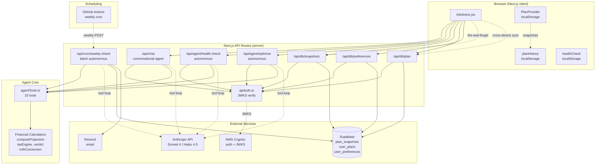
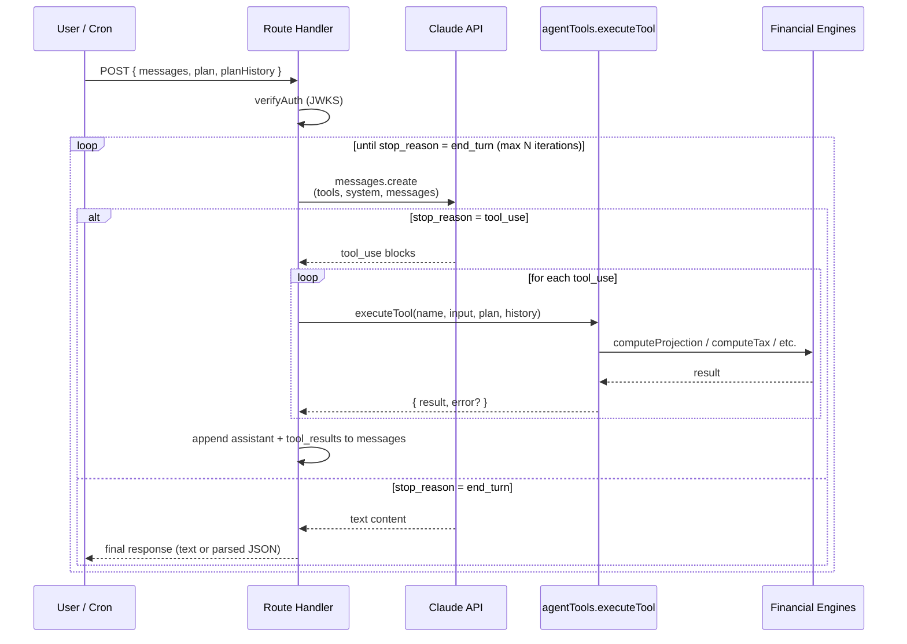
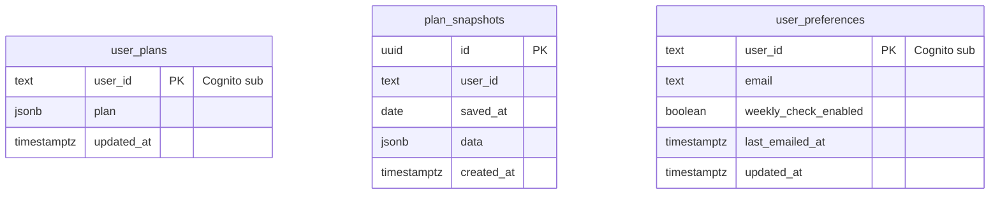

# Architecture — Agentic AI Layer

System documentation for the Level 3 agentic AI built on top of Retire.Simplified.
Covers the agent endpoints, tool catalog, data flow, and scheduled pipeline added during the 30-day sprint.

---

## 1. Overview

Retire.Simplified is a Next.js 16 / React 19 retirement planning app deployed to AWS Amplify, authenticated via Cognito. The agentic layer adds:

- **10 Claude tools** wrapping the existing financial calculators (`computeProjection`, `taxEngine`, `verdict`, `rothConversion`, etc.) as callable functions
- **4 agent endpoints** that run an agentic tool-use loop (one conversational, three autonomous)
- **A persistence layer** in Supabase (plans + snapshot history + user preferences)
- **A scheduled cron pipeline** (GitHub Actions → `/api/cron/weekly-check` → Claude → Resend) that emails users a weekly plan health report

---

## 2. System Architecture



---

## 3. Agent Inventory

Four endpoints, each running the same agentic tool-use loop pattern but with different system prompts and termination conditions.

### 3.1 `/api/chat` — Conversational Agent

**File:** [app/api/chat/route.js](app/api/chat/route.js)
**Model:** `claude-sonnet-4-20250514`
**Max iterations:** 5
**Triggered by:** User typing a message in the AI Advisor UI
**Tools available:** All 10
**Output:** Free-form text response

The user-facing chat. Receives `{ messages, plan, planHistory }` and runs the agentic loop until Claude returns `stop_reason: end_turn`. System prompt (`AI_AGENT_SYSTEM_PROMPT` in `lib/constants.ts`) instructs Claude to call tools for plan-specific questions and answer directly for general education questions.

### 3.2 `/api/agent/health-check` — Weekly Plan Analyzer

**File:** [app/api/agent/health-check/route.ts](app/api/agent/health-check/route.ts)
**Model:** `claude-sonnet-4-20250514`
**Max iterations:** 8
**Triggered by:** AIAdvisor mount, if `isHealthCheckDue()` (7-day interval)
**Tools used:** `get_plan_summary` → `run_projection` → `get_verdict` → `optimize_ss_claiming` → `get_plan_history`
**Output:** Structured JSON `HealthReport`

Autonomous — no user prompt. Claude is instructed to chain 5 specific tools and return JSON matching the `HealthReport` interface (overall score, alerts, recommendations, key metrics, email summary). Falls back to a stub report if JSON parsing fails.

### 3.3 `/api/agent/optimize` — Ranked Optimization Agent

**File:** [app/api/agent/optimize/route.ts](app/api/agent/optimize/route.ts)
**Model:** `claude-sonnet-4-20250514`
**Max iterations:** 10
**Triggered by:** "⚡ Optimize My Plan" button
**Tools used:** `get_plan_summary` → `run_full_optimization` → `optimize_ss_claiming` → `analyze_withdrawal_order`
**Output:** Structured JSON `OptimizationReport`

The most ambitious agent — chains multi-step reasoning across SS timing, Roth conversions, withdrawal order, and scenario comparison. Returns a ranked action list with estimated dollar impact per change.

### 3.4 `/api/cron/weekly-check` — Batch Email Pipeline

**File:** [app/api/cron/weekly-check/route.ts](app/api/cron/weekly-check/route.ts)
**Model:** `claude-haiku-4-5`
**Max iterations:** 8
**Triggered by:** GitHub Actions (`weekly-check.yml`) every Monday 08:00 UTC
**Auth:** `Authorization: Bearer ${CRON_SECRET}` (not Cognito)
**Batch size:** 10 users per invocation ⚠️ *no resumption — see Known Issues*

For each opted-in user:
1. Load plan from `user_plans`
2. Load 90 days of snapshots from `plan_snapshots`
3. Run autonomous health check via Claude (Haiku for cost)
4. Build email via `buildHealthCheckEmail()` (HTML + text)
5. Send via Resend
6. Update `last_emailed_at`

---

## 4. Tool Catalog

All 10 tools live in [lib/agentTools.ts](lib/agentTools.ts). Each tool has a JSON-schema `definition` (sent to Claude) and an `execute` function (runs server-side against the plan).

| # | Tool | Wraps | Description |
|---|------|-------|-------------|
| 1 | `get_plan_summary` | PlanProvider state | Demographics, savings breakdown, income sources, assumptions |
| 2 | `run_projection` | `computeProjection` | Year-by-year projection; supports plan overrides for what-if scenarios |
| 3 | `get_verdict` | `computeVerdict` | Fidelity benchmark gap + ranked actions |
| 4 | `run_tax_estimate` | `computeTax` | Federal + state tax for any income scenario |
| 5 | `run_roth_analysis` | `modelRothLadder` | Roth conversion ladder vs. baseline (lifetime tax saved) |
| 6 | `compare_scenarios` | `computeProjection` × N | Side-by-side comparison of N plan overrides |
| 7 | `optimize_ss_claiming` | actuarial formulas | SS at 62/65/67/70: monthly, lifetime, breakeven ages |
| 8 | `get_plan_history` | snapshot store | Trend, changed fields, recent snapshots |
| 9 | `analyze_withdrawal_order` | `computeProjection` + ladder | Trad-first vs Roth-first vs bracket-fill ⚠️ *known bug* |
| 10 | `run_full_optimization` | chains 1+2+5+7 | Ranked action list with dollar impact |

---

## 5. Agentic Loop — Sequence

The same loop pattern runs in all 4 agent endpoints (currently duplicated; should be extracted to `lib/agentLoop.ts`).



---

## 6. Data Persistence

### 6.1 Client-side (localStorage)

| Key | Type | Owner | Purpose |
|-----|------|-------|---------|
| `myplan-v1` | `Plan` | PlanProvider | Current plan (pre-existing) |
| `plan-history-v1` | `PlanSnapshot[]` | planHistory.ts | Daily snapshots, max 90 |
| `health-check-last-run-v1` | `number` (ms) | healthCheck.ts | Last health-check timestamp |
| `health-check-report-v1` | `HealthReport` | healthCheck.ts | Cached last report |

⚠️ No `rs:` namespace prefix — collision risk if domain is shared.

### 6.2 Server-side (Supabase)

Defined in [supabase/migrations/](supabase/migrations/).



**Sync model:** localStorage is the offline cache; Supabase is the source of truth. `savePlanSnapshot()` writes both. `loadHistoryFromDb()` merges DB rows over the local cache on mount.

⚠️ RLS is disabled. All row filtering happens in API routes using the Cognito `sub` claim. This is safe only if `verifyAuth()` is sound (now fixed via JWKS, but service-role access from Next.js routes means any bypass = full read).

---

## 7. Scheduled Pipeline

```mermaid
flowchart LR
    A[GitHub Actions<br/>weekly-check.yml<br/>cron: 0 8 * * 1] -->|curl POST<br/>Bearer CRON_SECRET| B[/api/cron/weekly-check]
    B -->|getUsersForWeeklyCheck<br/>where enabled = true<br/>and last_emailed_at < 6d ago| C[(Supabase)]
    B -->|batch of 10| D[runHealthCheckForUser]
    D -->|tool loop| E[Claude Haiku]
    E -->|JSON report| D
    D -->|buildHealthCheckEmail| F[Resend]
    F -->|email sent| G[updateLastEmailed]
    G --> C
```

**Triggers:** Mondays 08:00 UTC, plus manual via GitHub Actions UI (`workflow_dispatch`).

**Secrets required:**
- GitHub: `APP_URL`, `CRON_SECRET`
- Server env: `CRON_SECRET`, `ANTHROPIC_API_KEY`, `SUPABASE_URL`, `SUPABASE_SERVICE_KEY`, `RESEND_API_KEY`

---

## 8. Security Model

| Layer | Mechanism | Notes |
|-------|-----------|-------|
| User auth | Cognito JWT verified via JWKS (`lib/apiAuth.ts`) | ✅ Signature + issuer + audience + token_use + sub |
| Cron auth | `CRON_SECRET` bearer token | ⚠️ Non-constant-time compare (see Known Issues) |
| DB access | Supabase service-role key, server-only | Bypasses RLS — all filtering in API routes |
| Rate limiting | In-memory per-IP (`checkRateLimit`) | Per-instance; replace with Redis for multi-instance |
| Anthropic key | `ANTHROPIC_API_KEY` env, server-only | Never exposed to client |
| Resend key | `RESEND_API_KEY` env, server-only | Same |

**Trust boundaries:**
- Client cannot mutate other users' data (relies on JWKS-verified `sub` claim)
- Client never sees system prompts or tool schemas (all server-side)
- Plan data crosses the trust boundary on every chat request — the API trusts what the client sends as the plan, then writes it to the DB on PUT

---

## 9. Environment Variables

```bash
# Cognito (client + server)
NEXT_PUBLIC_AWS_REGION=
NEXT_PUBLIC_USER_POOL_ID=
NEXT_PUBLIC_USER_POOL_CLIENT_ID=
NEXT_PUBLIC_COGNITO_DOMAIN=
NEXT_PUBLIC_API_URL=

# Server-only secrets
ANTHROPIC_API_KEY=
SUPABASE_URL=
SUPABASE_SERVICE_KEY=
RESEND_API_KEY=
CRON_SECRET=
```

See [.env.local.example](.env.local.example).

---

## 10. Known Issues (from code review, not yet fixed)

| Severity | Location | Issue |
|---|---|---|
| **CRITICAL** | `agentTools.ts:690` — `analyze_withdrawal_order` | "Roth-first" approximation swaps 401k ↔ Roth balances. Engine taxes 401k as ordinary income and applies RMDs — swap inverts both. Output is nonsense. |
| ~~CRITICAL~~ ✅ fixed | `weekly-check/route.ts` | Model ID corrected to `claude-haiku-4-5`. |
| ~~CRITICAL~~ ✅ fixed | `weekly-check/route.ts` | Cost cap: `WEEKLY_CHECK_BATCH_SIZE` (default 50, hard ceiling 200), kill switch `WEEKLY_CHECK_DISABLED`, timing-safe `CRON_SECRET` compare. |
| **CRITICAL** | `001_plan_snapshots.sql` | RLS disabled + service-role keys = single auth bypass → full DB read. |
| SIGNIFICANT | `agentTools.ts:512` | SS lifetime benefit formula uses FV-of-annuity, not PV. Overstates by ~1.5×, biases "claim at 70" recommendation. |
| SIGNIFICANT | `weekly-check/route.ts` | Processes first 10 users only, no cursor/resumption. Users 11+ never get emailed. |
| SIGNIFICANT | All 4 agent endpoints | Agentic loop duplicated. Extract to `lib/agentLoop.ts`. |
| SIGNIFICANT | `AIAdvisor.jsx:29` | `useEffect([])` captures initial plan; later edits don't re-sync. |
| MINOR | `lib/constants.ts:100` | System prompt says "7 tools", catalog has 10. Drift. |

**Verdict:** demo-level working, not production-ready. Fix CRITICALs before shipping to real users.

---

## 11. File Map

```
app/
  api/
    chat/route.js                    Conversational agent
    plaid/route.js                   (pre-existing)
    agent/
      health-check/route.ts          Autonomous health agent
      optimize/route.ts              Autonomous optimization agent
    cron/
      weekly-check/route.ts          Batch email pipeline
    db/
      plan/route.ts                  Cross-device plan sync
      snapshots/route.ts             Daily snapshot persistence
      preferences/route.ts           Email opt-in toggle
lib/
  agentTools.ts                      10 tool definitions + executors
  apiAuth.ts                         JWKS-verified Cognito auth
  constants.ts                       AI_AGENT_SYSTEM_PROMPT
  db.ts                              Supabase REST client
  email.ts                           Resend helper + email template
  healthCheck.ts                     Client-side scheduling + report cache
  planHistory.ts                     Snapshot save/load/DB sync
components/
  tabs/AIAdvisor.jsx                 UI for chat + optimize + email opt-in
supabase/migrations/
  001_plan_snapshots.sql             plan_snapshots + user_plans
  002_user_preferences.sql           user_preferences
.github/workflows/
  weekly-check.yml                   Monday 08:00 UTC trigger
scripts/
  testAgentTools.ts                  Smoke tests (42 assertions)
```
